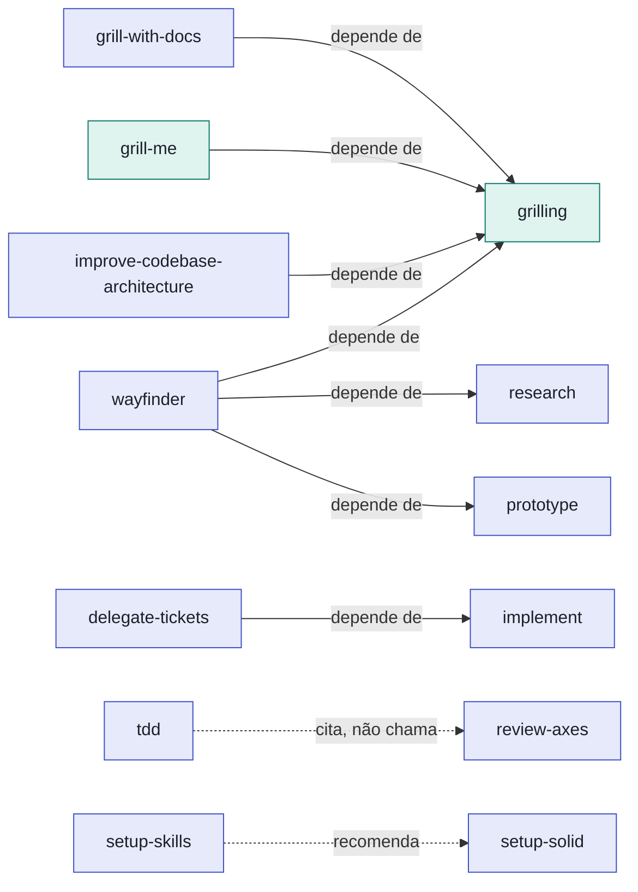

# Mapa de dependências entre skills

## O que é

Algumas skills chamam outra skill por baixo dos panos (via `Skill tool`) para funcionar. Se você instalar seletivamente com `npx skills@latest add`, a skill de baixo precisa estar disponível também, ou a de cima quebra na hora que tentar chamá-la. Este documento mapeia essas dependências para todas as skills do repositório.

## Para que serve

- Antes de instalar uma skill isolada, conferir se ela precisa de outra junto.
- Entender por que `grilling` (productivity/) aparece como pré-requisito de várias skills de engineering/.

## Grafo

Seta cheia = dependência real (a skill chama a outra pelo `Skill tool` ou delega a ela). Seta tracejada = referência solta no texto, não precisa instalar a outra.

## Dependências obrigatórias

Se você quiser instalar só uma dessas skills, instale a coluna da direita junto:

| Skill                            | Também precisa de                   |
| --------------------------------- | ------------------------------------ |
| `grill-me`                        | `grilling`                           |
| `grill-with-docs`                 | `grilling`                           |
| `improve-codebase-architecture`   | `grilling`                           |
| `wayfinder`                       | `grilling`, `research`, `prototype`  |
| `delegate-tickets`                | `implement`                          |

`grilling` é a primitiva: `grill-me`, `grill-with-docs`, `wayfinder` e `improve-codebase-architecture` chamam o `Skill tool` com `"grilling"` diretamente. `research` e `prototype` são chamadas por `wayfinder` ao resolver tickets de decisão, mas também funcionam sozinhas (têm entrada própria no README).

## Referências soltas (não são dependência)

Estas menções aparecem no texto de uma `SKILL.md`, mas não exigem instalar a outra skill:

- **`tdd`** cita `review-axes` só para dizer "refactoring é etapa de review, não do loop TDD" — não a chama.
- **`review-mr`** avisa explicitamente "isto não é o `/review-axes`" — é uma nota de desambiguação, as duas são independentes.
- **`setup-skills`** recomenda `setup-solid` como companheira ao final, e checa opcionalmente se uma skill *externa* chamada `triage` (fora deste repo) está instalada, para decidir se roda uma seção opcional.
- **`ask-skills`** é o router: descreve `grill-with-docs`, `grill-me`, `wizard` e `wait-what` para o usuário escolher, mas não as executa.
- **`writing-fragments`** / **`writing-shape`** / **`writing-beats`** (in-progress/) seguem um fluxo de convenção (o material bruto de uma alimenta a outra), mas nenhuma chama o `Skill tool` da outra formalmente. `writing-fragments` descreve "rodar uma sessão de grilling" em prosa, sem chamar `grilling` de fato.
- **`handoff`** e **`claude-handoff`** sugerem dinamicamente "próximas skills" no documento gerado; varia por sessão, não é uma dependência fixa.

## Buckets sem dependências entre si

Todas as skills de `misc/` (`reset-agent-env`, `setup-pre-commit`, `setup-statusline`, `diagnosing-bugs`) e a maioria de `engineering/` e `productivity/` não citadas acima são independentes: instalam e funcionam sozinhas.
