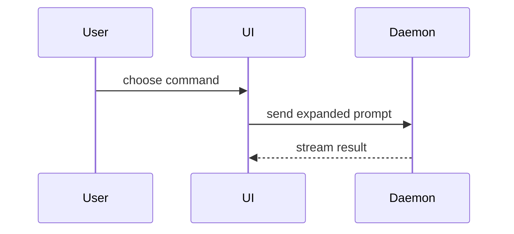

```yaml
name: pr
description: "Use ao escrever o corpo de um PR."
metadata:
  credits:
    skill: show-me
    author: Dex Horthy
    organisation: Humanlayer
    url: "https://github.com/humanlayer/skills/blob/main/plugins/show-me/skills/show-me/SKILL.md"
```

Use este modelo para escrever o corpo do PR:

```markdown
## Summary

<diagram, diff-sketch, or tree>

## Evidence

- **Before:** <screenshot/output/failing test run>
  **After:** <screenshot/output/passing test run>

## Merge Danger

**Door:** <one-way or two-way>

<optional: description>

**Blast Radius:** <one-word description>

<optional: potential ramifications of merge>
```

O modelo acima é mantido em inglês porque os cabeçalhos (`## Summary`, `## Evidence`, `## Merge Danger`, `**Door:**`, `**Blast Radius:**`) são o formato literal do PR gerado. Traduza apenas o conteúdo que você preencher, se o usuário pedir um PR em outro idioma.

## Seções

Pule todos os preâmbulos e mantenha a prosa breve. Use a linguagem de domínio do usuário, a partir do `GLOSSARY.md`.

### Summary

Escolha a visualização mais simples que deixe claro o ponto principal.

- Mostre lógica ou um algoritmo como pseudocódigo:

```text
on(save)
  if content is unchanged
    return cached result
  write new content
  return fresh result
```

- Mostre o fluxo de controle em tempo de execução como uma árvore de chamadas:

```text
submitForm
  createSession
    persistPrompt
    launchAgent
  navigateToSession
```

- Mostre a estrutura de UI como uma árvore de componentes, incluindo estado e as fronteiras de módulo que importam:

```text
<SessionPage> (apps/example/src/routes/session.tsx)
  useSessionEvents()
  <SessionToolbar>
    <RunSkillButton> (packages/ui)
```

- Mostre a responsabilidade de um arquivo ou uma refatoração ampla como uma árvore de arquivos rasa:

```text
src/
├── commands/       # parses user actions
├── sessions/       # owns session state
└── transport/      # sends API requests
```

- Mostre a interação entre componentes, o fluxo de controle ou o fluxo de dados com Mermaid:



- Use `diff` quando o ponto for o que muda e a forma ao redor já existe. Adapte o formato do diff ao assunto.

Para uma mudança de componente:

```diff
 <SessionPage>
   useSessionEvents()
   <SessionToolbar>
+    <RunSkillButton />
   <SessionTimeline>
+    <SkillResultCard />
```

Para uma mudança de layout de arquivos:

```diff
 src/
 ├── commands/
+│   └── show-me.ts       # expands the slash command
 ├── sessions/
-└── transport.ts
+└── transport/
+    ├── client.ts
+    └── stream.ts
```

Para uma mudança de árvore de chamadas ou pilha de chamadas:

```diff
 submitForm
   createSession
     persistPrompt
+    expandSkillMention
     launchAgent
-  navigateToSession
+  navigateToSession
+    subscribeToEvents
```

Para uma mudança de estado ou de fluxo de controle:

```diff
 on(save)
-  write content
+  if content is unchanged
+    return cached result
+  write new content
+  invalidate cache
```

- Mostre o bloco inteiro quando a maior parte for nova, quando o contexto omitido esconderia a propriedade ou a ordem, ou quando o usuário precisar de um formato-alvo copiável:

```ts
function expandSkill(command: string): string {
  const skillName = command.slice(1);
  return `use the ${skillName} skill`;
}
```

#### Orientação

Coloque cada visual ao lado do texto curto que ele sustenta. Mantenha apenas as chamadas, arquivos, props, estados e fronteiras necessários para responder à pergunta atual do usuário ou às opções a resolver no ponto de discussão atual.

Você pode usar um destes, pode usar vários, é improvável que use todos. Use o seu critério e não sobrecarregue o usuário.

### Evidence

Evidência concreta de que a mudança funciona. Mostre um antes e um depois.

Capturas de tela são de nível S, quando o ambiente estiver preparado para isso e a mudança for visual.

Evidência baseada em execução é de nível A. Resultados de testes, saída do console. Mostre exatamente o teste que passa a falhar e a passar, em pseudocódigo.

### Merge Danger

Descreva se é uma porta de mão única ou de mão dupla. Você pode voltar atrás por portas de mão dupla, mas não por portas de mão única. Um PR barato de reverter tem risco menor. Mudanças que envolvem ações destrutivas ou decisões difíceis de desfazer são portas de mão única.

O raio de impacto (blast radius) é o impacto potencial ou o escopo das mudanças introduzidas por este PR. Considere todas as possibilidades. Exemplos são deslocamento de layout, quebras para consumidores, responsividade para mobile etc.
